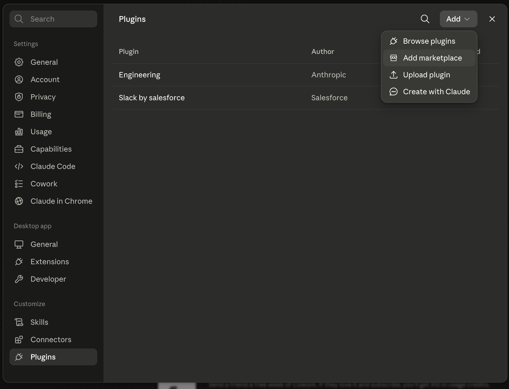
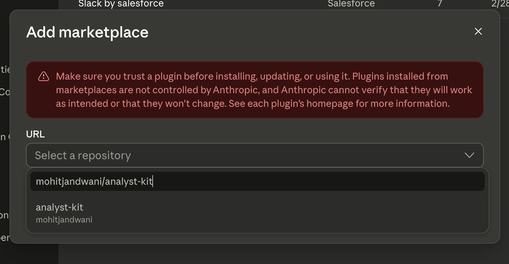

# Analyst Kit

Installable, hedge-fund-grade **equity-research skills** for AI coding agents.
Each skill is a self-contained folder of instructions (and, where useful, runnable
scripts) that an agent loads on demand. Install them into Claude Code as a plugin,
or copy them into any agent runtime with the bundled installer.

The skill frontmatter is the single source of truth — the registry, the plugin
bundle, and the installer all derive from it.

## What's inside

The skills split into **capabilities** (one atomic job — a data source, an engine,
a deliverable, or reusable knowledge) and **workflows** (an engagement entry point
that orchestrates capabilities via `requires:`). The "Needs" column lists runtimes,
API keys, and required skills.

| Skill | Type | What it does | Needs |
|-------|------|--------------|-------|
| **analyst-playbook** | capability | How to structure any analysis before fetching a number: pick the deliverable, align fiscal calendars and frequencies, normalize units, route series to the right skill, and apply per-sector conventions | — |
| **13f-analysis** | capability | Fetch & read U.S. institutional **13F-HR** holdings from SEC EDGAR — resolve a fund to its CIK, pull a quarter's holdings as a normalized, ranked CSV, and read it without the common traps | Python (stdlib) |
| **sec-filings** | capability | Fetch & read U.S. SEC filings (10-K, 10-Q, 8-K, any EDGAR form) — risk factors, MD&A, material events, segment data, insider trades, earnings 8-K exhibits — with ticker→CIK resolution and BM25 search for large filings | Python (stdlib) |
| **financialmodellingprep** | capability | Call the Financial Modeling Prep REST API — daily prices, news, profiles, screener, quarterly income statements, fiscal-period info, earnings-call transcripts — with exact endpoints, params, and field schemas | Python · `FMP_API_KEY` |
| **finmind** | capability | Pull Taiwan (TWSE/TPEx) market data — prices, monthly revenue, financials, dividends, shareholding, institutional flows — via the FinMind API | Python · `FINMIND_TOKEN` |
| **market-intelligence** | capability | Nowcast a company's quarter and predict a revenue segment from Google Trends search-interest (via SerpAPI) — keyword selection, normalization to a quarterly index, and a quarter-to-date nowcast | Python · `SERPAPI_API_KEY` |
| **company-universe-manager** | capability | Own a watchlist of companies **and their key dates** (earnings, investor days, ex-dividend, AGMs…): roster CRUD, a daily monitor that detects date changes, and a daily brief (markdown or branded PDF). Pluggable local-folder or connected-server storage | Python · financialmodellingprep, reporting |
| **analyzing-financial-statements** | capability | Calculate & interpret financial ratios (profitability, liquidity, leverage, efficiency, valuation, per-share) from statement data, with industry benchmarking | Python (stdlib) |
| **creating-financial-models** | capability | DCF valuation, M&A accretion/dilution, sensitivity analysis (data tables, tornado charts), and probability-weighted best/base/worst scenario planning | Python · numpy/pandas |
| **charting** | capability | Financially-correct charts: a thin Python/Polars layer normalizes data → a TypeScript layer emits Highcharts options + a self-contained HTML page (trends, segments, margins, dividends, surprise, waterfalls, price) | Node · Python |
| **reporting** | capability | Assemble charts, tables, and analyst text into a branded PDF — A4 portrait report or 16:9 deck — from ready-made page templates; remembers your logo and brand colors | Node · charting |
| **wiki-builder** | capability | Serve any folder of markdown as a navigable browser wiki (sidebar, table of contents, frontmatter chips, ECharts) | Bun |
| **data-analysis** | capability | End-to-end analysis of a structured dataset (CSV/JSON/Excel/SQL) — profile, clean, visualize, model, and report with reproducible code | — |
| **single-stock-deep-dive** | workflow | Forensic, decision-useful deep dive on one stock: thesis, valuation, catalysts, variant perception, value-chain adjacencies | — |
| **thematic-investing** | workflow | Map a theme or trend into an investable value chain — who benefits, where value accrues, what's mispriced | company-universe-manager |
| **technical-analysis** | workflow | Disciplined technical analysis with concrete entry/exit levels: regime classification, a three-layer confluence stack, and ATR-based stops/sizing/targets from a zero-dependency indicator engine | Python · charting |
| **company-wiki** | workflow | Build a multi-page company-research wiki (overview, products, 5-year financials, model, competitors, citations) as a deployed web app | `FMP_API_KEY` · wiki-builder, company-universe-manager |

## Install

The **plugin** is the primary way to install Analyst Kit — one marketplace, one
plugin, the same in **Claude Code** and **[Claude Cowork](https://claude.com/product/cowork)**
(Anthropic's desktop app). It bundles everything: all the skills, the
**research-auditor** subagent that fact-checks every deliverable, and a SessionStart
hook that runs the runtime (onboarding, update checks, telemetry). No clone, no Node.

**Claude Code** — paste these two commands:

```
/plugin marketplace add mohitjandwani/analyst-kit
/plugin install analyst-kit@analyst-kit
```

> Enabling the plugin prompts for your keys (all stored in the OS keychain): **`FMP_API_KEY` is required**;
> `FINMIND_TOKEN` (Taiwan) and `SERPAPI_API_KEY` (Google Trends) are optional — fill them now, later via
> `/plugin` → configure, or when a skill first asks. SEC filings need no key.

**Claude Cowork** (desktop app) — same marketplace, no terminal:

1. Open **Customize → Plugins**, click **Add ▾** (top right), and choose **Add marketplace**.

   

2. In the **Add marketplace** dialog, enter your repo and select it: `mohitjandwani/analyst-kit`.

   

3. Add the **analyst-kit** plugin, then enable **Settings → Capabilities → Code execution** (the skills run scripts).

> **On Windows:** run inside **WSL2** — native Windows (PowerShell/cmd) is unsupported because the skill
> runtime is POSIX/bash. See [Windows: use WSL2](#windows-use-wsl2) below.

### Alternative: the Node installer (Codex, OpenClaw, or no marketplace)

Prefer copying skills straight into a runtime, or installing for **Codex** / **OpenClaw**?
One command installs *all* the skills and wires them into the agent's system/common
prompt. Needs only **Node ≥ 18** (it detects your OS and installs to the right paths):

```bash
npx github:mohitjandwani/analyst-kit claude-code      # or: codex · openclaw · cowork
```

Swap `claude-code` for `codex`, `openclaw`, or `cowork`; add `--scope project` to install into the current
project (`./.claude/skills`, …) instead of your home directory. Already cloned the repo? `node bin/analyst-kit.js
claude-code` does the same (plus `list`, `doctor`, `uninstall`, or `install <skill|persona>` for just one).

For **Claude Cowork** via this installer, the command prints the in-app steps and writes
`cowork-global-instructions.md` to paste into **Settings → Cowork → Global instructions** — but the
plugin path above is simpler and recommended.

### Check it worked

After installing, ask a trigger phrase (e.g. "deep dive on NVDA") and the matching skill loads. From a clone
you can also self-test the installers across every platform:

```bash
npm run test:integration     # real installs per platform + the path.win32 path-layer check
```

Codex (any OS, no ChatGPT login needed) — confirm a skill is reachable with an API key:

```bash
CODEX_API_KEY=sk-... codex exec --json "use the sec-filings skill to list NVDA's latest 8-K"
```

See **[compatibility.md](compatibility.md)** for what each runtime does underneath — where skills land, the
routing table, and Windows specifics.

### Windows: use WSL2

Analyst Kit's skills run a POSIX/bash runtime (`analyst-kit-core`), so on Windows they are
supported **only inside WSL2**. This matches what the agents themselves require:
Claude Code's sandbox runs on macOS, Linux, and WSL2 (native Windows is
unsupported), and Codex's Linux mode is WSL2 as well.

- **Recommended:** install [WSL2](https://learn.microsoft.com/windows/wsl/install),
  then run Claude Code (or Codex) **and** this installer *inside* your WSL2
  distribution — everything then behaves exactly like Linux.
- Native Windows (PowerShell/cmd) cannot run the bash runtime at all. Native
  Windows + Git Bash will run the scripts but without enforced `.env` file
  permissions (`chmod` is a no-op on NTFS) and without sandboxing — unsupported.

`node bin/analyst-kit.js doctor --platform claude-code` warns when run on native Windows.

## What the plugin bundles

The **analyst-kit** plugin is the whole kit in one install — no market-specific
variants to pick between. It ships:

- **All 18 skills** — every research workflow (deep dive, thematic, technical
  analysis, company wiki) plus their supporting capabilities and all data sources
  (US SEC/FMP, global, and Taiwan FinMind/TWSE).
- **The `research-auditor` subagent** — invoked after each research deliverable to
  re-check every figure and claim against its sources, flagging hallucinations,
  stale or mis-scaled data, math errors, and unsupported assertions before the work
  reaches you.
- **A SessionStart hook** — runs the `analyst-kit-core` runtime automatically:
  onboarding on first use, a once-a-day update check, and the telemetry notice.

The plugin is a **self-contained, generated bundle** under `plugins/analyst-kit/`:
its `skills/` are copied from the top-level `skills/` source of truth by
`npm run build:plugin` (CI fails if the two drift), because a marketplace plugin is
installed into an isolated cache and can't reference files outside its own folder.
Run `node bin/analyst-kit.js list` to see every skill, or
`node bin/analyst-kit.js install analyst-kit --dry-run` for the full resolved closure.

## API keys

When you enable the plugin on Claude Code/Cowork it prompts for your keys (stored in
the OS keychain; the SessionStart hook bridges them to the scripts): **`FMP_API_KEY`
is required**, while `FINMIND_TOKEN` and `SERPAPI_API_KEY` are optional fields you can
fill now, later via `/plugin` → configure, or when a skill first needs one. SEC EDGAR
works with **no key** (a per-install `SEC_EDGAR_UA` is generated automatically). The
Node installer / Codex prompt for any missing key interactively and store it in a
git-ignored `.env` (see [`.env.example`](.env.example)).

| Variable | Used by | Required | Get it |
|----------|---------|----------|--------|
| `FMP_API_KEY` | financialmodellingprep, company-wiki, company-universe-manager | **Yes** — plugin config | <https://site.financialmodelingprep.com/developer/docs> |
| `FINMIND_TOKEN` | finmind | Optional (Taiwan data) | <https://finmindtrade.com/> (free) |
| `SERPAPI_API_KEY` | market-intelligence | Optional (Google Trends) | <https://serpapi.com/> (free tier = 100/mo) |
| `SEC_EDGAR_UA` | sec-filings, 13f-analysis | Auto-generated | — (override only if you want a real contact) |

Skills that run code bootstrap their own dependencies on first use. Runtimes are a
per-skill prerequisite the installer does not install for you: **Python** (finmind,
company-universe-manager; 13f-analysis is standard-library only) and **Bun**
(wiki-builder).

## The `~/.analyst-kit` data home, analytics & updates

Every skill runs on a shared runtime (`analyst-kit-core`, installed automatically as a
dependency) that keeps all per-user state in one fixed place, `~/.analyst-kit/`:

- `.env` — your API keys (chmod 600, shared across projects)
- `config` — settings (`analyst-kit-core/bin/analyst-kit-config get|set|list`)
- `analytics/skill-usage.jsonl` — **local** usage log: which skill ran, when,
  outcome, duration
- `learnings.jsonl` — things the skills learned about your setup and preferences,
  so mistakes aren't repeated

**Telemetry is on by default (anonymous, opt-out).** It sends only skill name,
version, outcome, and duration — never repo names, file paths, tickers, or content —
and is what tells us which skills break or run slow, so keeping it on directly
improves your experience. You're told about it once on first run. Tiers: `community`
(default, stable anonymous id), `anonymous` (no id), `off`. Opt out any time:

```bash
~/.claude/skills/analyst-kit-core/bin/analyst-kit-config set telemetry off
```

**Updates:** skills check the published version at most once a day and offer a
guided upgrade when a new release is out (declining snoozes it for a week; disable
with `analyst-kit-config set update_check false`).

## Skill format

Each skill is `skills/<name>/SKILL.md` with YAML frontmatter:

```yaml
---
name: 13f-analysis          # kebab-case; must equal the folder name
type: capability            # capability | workflow
description: >              # what it does + a "Triggers:" clause of trigger phrases
  ... Triggers: "get the 13F for X", "what does <fund> own", ...
requires: [ ... ]           # capability skills this one builds on (nothing may require a workflow)
env: [ FMP_API_KEY ]        # API keys the skill needs
---
```

Agents read only `name` + `description`, so trigger phrases live inside the
description. `type`, `requires`, and `env` drive the installer and validator.

## Development

```bash
npm run validate         # lint skills + plugin manifests (+ preamble sync check)
npm run build:registry   # regenerate registry.json from frontmatter
npm run check:registry   # verify registry.json is in sync
npm run sync:preamble    # regenerate the analyst-kit-core blocks in every SKILL.md
```

`registry.json` is generated — edit skill frontmatter, then rebuild it. The
`<!-- analyst-kit:preamble/epilogue -->` blocks in each SKILL.md are also generated — edit
`skills/analyst-kit-core/templates/` and re-sync; never edit between the markers. The same
checks run in CI (`.github/workflows/validate.yml`) on every push and pull request.

## Roadmap

Planned skills, not yet available: an LBO model (debt schedule, cash sweep,
IRR/MOIC) and PDF report analysis.

## Acknowledgments

- **`analyzing-financial-statements`** and the DCF + sensitivity tooling in
  **`creating-financial-models`** were inspired by the custom financial skills
  in [Anthropic's claude-cookbooks](https://github.com/anthropics/claude-cookbooks/tree/main/skills/custom_skills),
  then reworked to this repo's skill contract (frontmatter, `scripts/` layout)
  and hardened with input guards and a test suite.
- The M&A accretion/dilution model in **`creating-financial-models`** was
  inspired by [joe-neary/MergerDealSimulator](https://github.com/joe-neary/MergerDealSimulator).
  The financial formulas were reimplemented from scratch (no code was copied);
  that project's worked example serves as an independent cross-check in the
  skill's test suite.

## License

MIT © Mohit Kumar
